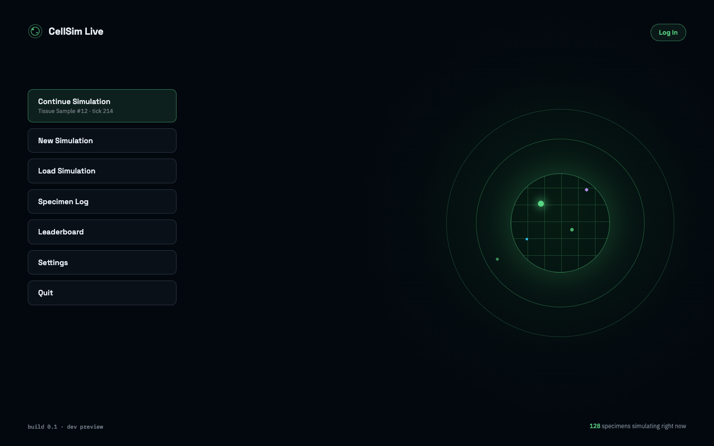
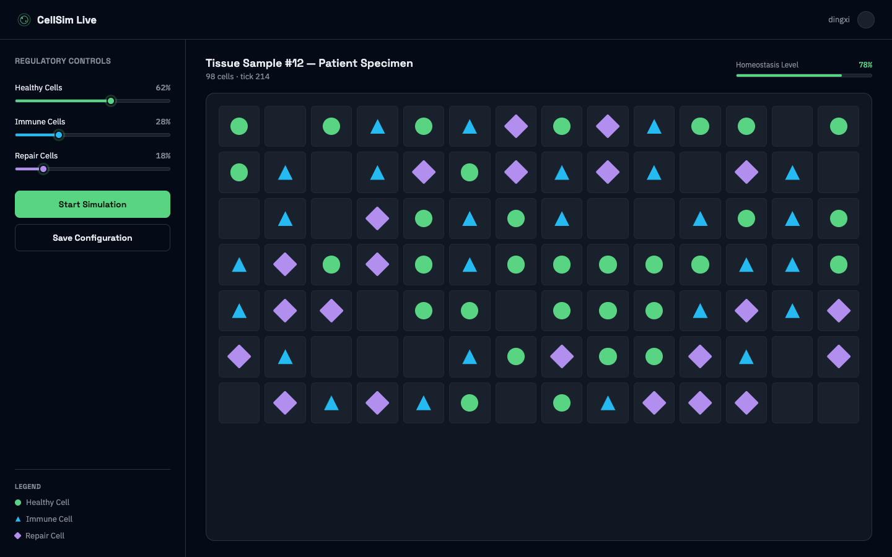
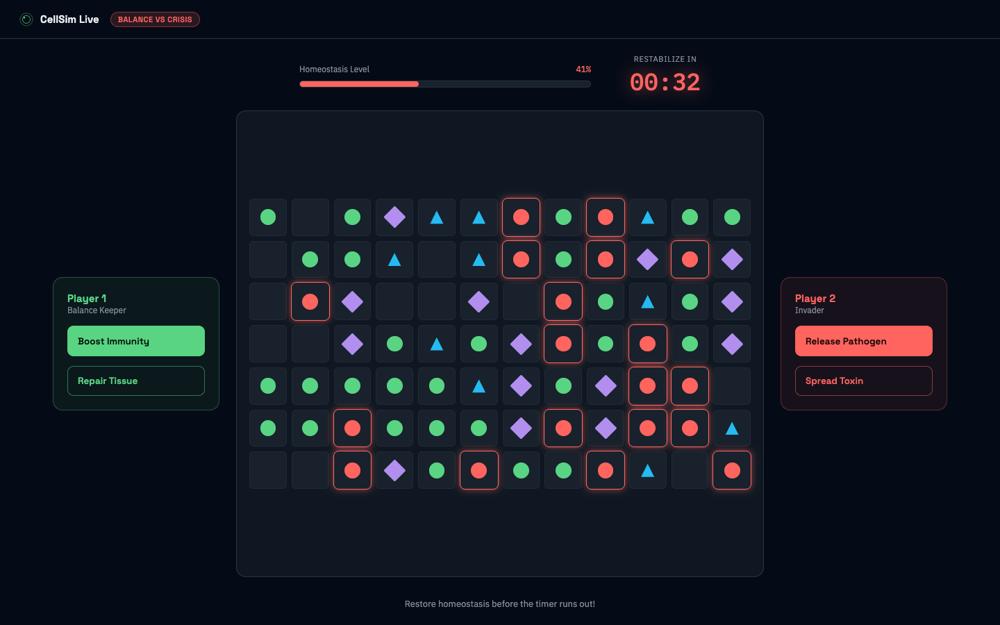

CellSim Live

[My Notes](notes.md)

CellSim Live is a real-time, two-player simulation of the human body's fight to stay in balance.

### Elevator pitch

CellSim Live is a real-time, two-player simulation of the human body's internal balance. One player defends it as the "Balance Keeper," boosting immunity and repairing tissue. The other attacks as the "Invader," releasing pathogens and toxins. A simple rule-based engine drives every cell on the grid in real time, so no two matches play out the same way. It's Conway's Game of Life meets a live immunology experiment.

### Design

A control panel on one side sets the starting cell populations; a live grid on the other shows the tissue sample evolving. In "Balance vs. Crisis" mode, a Homeostasis meter and countdown timer sit up top, and each player gets two action buttons.

### Key features

- Set starting cell populations and watch the tissue evolve live
- Two-player "Balance vs. Crisis" mode with a countdown timer
- Save configurations and compete on a fastest-recovery leaderboard
- Auto-generated specimen names and facts from a third-party API

### Technologies

I am going to use the required technologies in the following ways.

- **HTML** - The login/menu page and the main simulation dashboard.
- **CSS** - Responsive layout with visual states tied to the Homeostasis Level.
- **React** - Component-based UI (grid, sliders, meter, leaderboard) that re-renders from WebSocket updates; routes between menu, lobby, and simulation.
- **Service** - Endpoints for rooms, saves, leaderboard, and login/logout; calls the [MyGene.info API](https://mygene.info/) to pull a real gene/protein summary fact for each cell type shown in the specimen log.
- **DB/Login** - Stores accounts, saved configurations, and the leaderboard.
- **WebSocket** - Broadcasts the live grid state and both players' actions in real time.

## 🚀 Specification Deliverable

> [!NOTE]
> Fill in this sections as the submission artifact for this deliverable. You can refer to this [example](https://github.com/webprogramming260/startup-example/blob/main/README.md) for inspiration.

For this deliverable I did the following. I checked the box `[x]` and added a description for things I completed.

- [x] I completed the prerequisites for this deliverable (Git commit requirement)
- [x] Proper use of Markdown
- [x] A concise and compelling elevator pitch
- [x] Description of key features
- [x] Description of how you will use each technology including your 3rd party API and use of WebSocket
- [x] One or more rough sketches of your application. Images must be embedded in this file using Markdown image references.

## 🚀 AWS deliverable

For this deliverable I did the following. I checked the box `[x]` and added a description for things I completed.

- [x] **Rented EC2 server** - Launched a t3.micro Ubuntu 26.04 LTS EC2 instance in us-east-2 (Ohio), installed Caddy as the web server.
- [x] **Leased domain name** -Registered `start-up-dingxi.click` through Route 53.
- [x] **Server accessible** from my domain: [https://startup.start-up-dingxi.click](https://startup.start-up-dingxi.click) — Configured a Route 53 A record pointing the domain at my EC2 instance's public IP, and edited the Caddyfile to enable automatic HTTPS via Let's Encrypt.

## 🚀 HTML deliverable

For this deliverable I did the following. I checked the box `[x]` and added a description for things I completed.

- [x] I completed the prerequisites for this deliverable (Simon deployed, GitHub link, Git commits)
- [x] **HTML pages** - Six pages: `index.html` (home menu), `login.html`, `play.html` (simulation), `leaderboard.html`, `log.html` (specimen log), and `settings.html`.
- [x] **Proper HTML element usage** - Each page uses `header`, `nav`, `main`, and `footer`, with `section`, `article`, `form`, `label`, `table`, and `ul`/`li` for content.
- [x] **Links** - The header nav links every page, the home menu links to Play, Log, Leaderboard, and Settings, and the footer links to my GitHub repo.
- [x] **Text** - Each page has headings and descriptive text, such as the home live activity list, the player role cards on Play, and the specimen descriptions on Log.
- [x] **3rd party API placeholder** - The home page has a "Quote of the day" placeholder for a quote API, and the Specimen Log page has placeholders for gene facts from the MyGene.info API.
- [x] **Images** - Design mockups (`images/Login.png`, `images/Main.png`, `images/BalanceVsChaos.png`) are embedded in this README. The pages draw the simulation visuals (radar and cell grid) with HTML elements styled by CSS.
- [x] **Login placeholder** - `login.html` has an email/password form with Log In and Create Account buttons, and the home page shows "Logged in as: Guest".
- [x] **DB data placeholder** - The leaderboard table shows recovery times that will be stored in and loaded from the database.
- [x] **WebSocket placeholder** - The home page "Live activity" panel and the two-player Play page (Balance Keeper vs. Invader) represent the real-time updates that will come over WebSocket.

## 🚀 CSS deliverable

For this deliverable I did the following. I checked the box `[x]` and added a description for things I completed.

- [x] I completed the prerequisites for this deliverable (Simon deployed, GitHub link, Git commits)
- [x] **Visually appealing colors and layout. No overflowing elements.** - A consistent dark theme defined with CSS variables (`--bg`, `--panel`, `--green`, `--red`, etc.) and panel-based layouts sized so content stays inside the viewport.
- [x] **Use of a CSS framework** - Bootstrap 5 for the navbar, buttons, forms, and the leaderboard table, with my own classes (like `.btn-keeper` and `.btn-invader`) on top.
- [x] **All visual elements styled using CSS** - Every element is styled in `main.css`, including the radar rings, the homeostasis meter, the cell grid, the player cards, and the log cards.
- [x] **Responsive to window resizing using flexbox and/or grid display** - CSS grid lays out the home page, the game area, the cell grid, and the log cards, and flexbox lays out the header, footer, and menus. Media queries at 900px, 768px, 600px, and 560px rearrange the layout on smaller screens.
- [x] **Use of a imported font** - Imported the Poppins font from Google Fonts and used it for the whole site.
- [x] **Use of different types of selectors including element, class, ID, and pseudo selectors** - Element selectors (`body`, `header`, `main`, `footer`, `a`), class selectors (`.panel`, `.cell`, `.menu-item`), ID selectors (`#brand`, `#countdown`), and pseudo selectors (`:hover`, `:focus`, `:last-child`, `::placeholder`).

## 🚀 React part 1: Routing deliverable

For this deliverable I did the following. I checked the box `[x]` and added a description for things I completed.

- [x] I completed the prerequisites for this deliverable (Simon React deployed at https://simon.start-up-dingxi.click, GitHub link in the footer of every page, Git commits)
- [x] **Bundled using Vite** - Installed Vite, React, React Router, and Bootstrap with npm. `npm run dev` runs the Vite dev server with hot reloading, and `deployReact.sh` runs `npm run build` to bundle the app for production.
- [x] **Components** - Converted all six HTML pages (Home, Login, Play, Leaderboard, Log, Settings) into React components under `src/`, with the shared header and footer in `src/app.jsx`. The original CSS was moved to `src/app.css` so every page keeps its original look. The Play cell grid is rendered from an array with `map()`.
- [x] **Router** - Used `BrowserRouter`, `Routes`, and `Route` from react-router-dom to map `/`, `/login`, `/play`, `/leaderboard`, `/log`, and `/settings` to their components, plus a catch-all 404 route. Navigation uses `NavLink`/`Link`, so pages switch without a full reload. Caddy uses `try_files {path} /index.html` so refreshing any route works.

## 🚀 React part 2: Reactivity deliverable

For this deliverable I did the following. I checked the box `[x]` and added a description for things I completed.

- [ ] I completed the prerequisites for this deliverable (Simon deployed, GitHub link, Git commits)
- [ ] **All functionality implemented or mocked out** - I did not complete this part of the deliverable.
- [ ] **Hooks** - I did not complete this part of the deliverable.

## 🚀 Service deliverable

For this deliverable I did the following. I checked the box `[x]` and added a description for things I completed.

- [ ] I completed the prerequisites for this deliverable (Simon deployed, GitHub link, Git commits)
- [ ] **Node.js/Express HTTP service** - I did not complete this part of the deliverable.
- [ ] **Static middleware for frontend** - I did not complete this part of the deliverable.
- [ ] **Calls to third party endpoints** - I did not complete this part of the deliverable.
- [ ] **Backend service endpoints** - I did not complete this part of the deliverable.
- [ ] **Frontend calls service endpoints** - I did not complete this part of the deliverable.
- [ ] **Supports registration, login, logout, and restricted endpoint** - I did not complete this part of the deliverable.
- [ ] **Uses BCrypt to hash passwords** - I did not complete this part of the deliverable.

## 🚀 DB deliverable

For this deliverable I did the following. I checked the box `[x]` and added a description for things I completed.

- [ ] I completed the prerequisites for this deliverable (Simon deployed, GitHub link, Git commits)
- [ ] **Stores data in MongoDB** - I did not complete this part of the deliverable.
- [ ] **Stores credentials in MongoDB** - I did not complete this part of the deliverable.

## 🚀 WebSocket deliverable

For this deliverable I did the following. I checked the box `[x]` and added a description for things I completed.

- [ ] I completed the prerequisites for this deliverable (Simon deployed, GitHub link, Git commits)
- [ ] **Backend listens for WebSocket connection** - I did not complete this part of the deliverable.
- [ ] **Frontend makes WebSocket connection** - I did not complete this part of the deliverable.
- [ ] **Data sent over WebSocket connection** - I did not complete this part of the deliverable.
- [ ] **WebSocket data displayed** - I did not complete this part of the deliverable.
- [ ] **Application is fully functional** - I did not complete this part of the deliverable.
